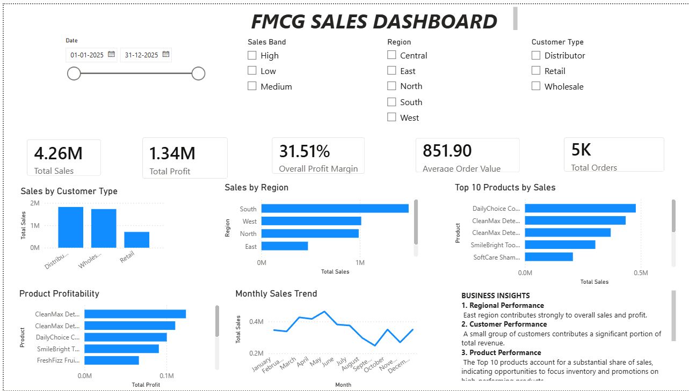

# FMCG Sales & Profitability Dashboard

## 📊 Project Overview

An interactive **FMCG Sales & Profitability Dashboard** developed using Microsoft Power BI to analyze sales performance, profitability, customers, products, regions, and sales bands.

The project demonstrates the use of **Power Query, data modelling, DAX measures, interactive visualizations, and slicers** to convert raw sales data into actionable business insights.

---

## 🎯 Project Objectives

* Analyze overall sales and profitability
* Track key business performance indicators
* Understand regional sales performance
* Analyze customer performance
* Identify top-performing products
* Analyze sales by sales band
* Provide interactive filtering using slicers
* Generate business insights from sales data

---

## 🛠️ Tools & Technologies

* **Microsoft Excel** — Data source
* **Power BI** — Dashboard development
* **Power Query** — Data cleaning and transformation
* **DAX** — Measures and KPI calculations
* **Data Modelling** — Relationships and Date Table
* **GitHub** — Project documentation and portfolio

---

## 📌 Key KPIs

The dashboard includes six key performance indicators:

* **Total Sales**
* **Total Profit**
* **Profit Margin**
* **Average Order Value (AOV)**
* **Total Orders**
* **Total Customers**

---

## 📈 Dashboard Features

### Customer Analysis

Analyzes sales performance across customers/customer segments.

### Regional Analysis

Compares sales and profitability across different regions.

### Top 10 Products

Identifies the highest-performing products based on sales performance.

### Sales Band Analysis

Analyzes performance across different sales-value bands.

### Interactive Slicers

The dashboard includes interactive filters for:

* Date
* Region
* Customer Segment
* Sales Band

These slicers allow users to dynamically explore the dashboard and see how the KPIs and visualizations change based on their selections.

---

## 🔄 Project Workflow

```text
Raw Sales Data
      ↓
Data Cleaning & Transformation
      ↓
Power Query
      ↓
Date Table & Data Modelling
      ↓
DAX Measures
      ↓
KPI Cards
      ↓
Interactive Visualizations
      ↓
Slicers
      ↓
Business Insights
```

---

## 💡 Business Insights

The dashboard is designed to help identify:

* Regional differences in sales and profitability
* High-performing customers and customer segments
* Top-performing products
* Performance across sales-value bands
* Opportunities for targeted sales and marketing actions

---

## 🖼️ Dashboard Preview

### Main Dashboard



---

## 📂 Project Files

| File                        | Description                  |
| --------------------------- | ---------------------------- |
| `FMCG_Sales_Dashboard.pbix` | Power BI dashboard project   |
| `FMCG_Sales_Data.xlsx`      | Source sales dataset         |
| `FMCG_Sales_Dashboard.pdf`  | PDF version of the dashboard |
| `screenshots/`              | Dashboard screenshots        |

---

## 🎓 Skills Demonstrated

* Data Cleaning
* Data Transformation
* Power Query
* Data Modelling
* DAX
* KPI Development
* Data Visualization
* Business Analysis
* Sales Analysis
* Customer Analysis
* Regional Analysis
* Dashboard Design
* Business Insights

---

## 🚀 Project Outcome

This project demonstrates how sales data can be transformed into an interactive business intelligence dashboard that supports analysis of **sales, profitability, customers, products, and regional performance**.

The project also demonstrates practical application of Power BI concepts including **Power Query, DAX, data modelling, interactive slicers, and dashboard design**.
